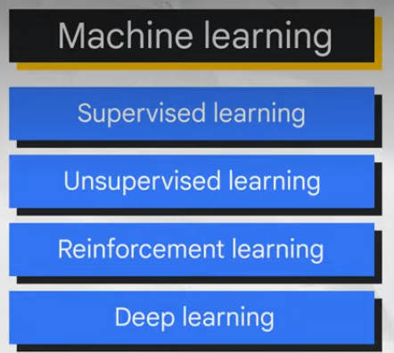

# Introduction to [Generative AI](https://medium.com/@hinaa.zubairr/introduction-to-generative-ai-gen-ai-caee7eb8ad9a) (Gen AI)

Please read my full article on this topic on:

Medium: (https://medium.com/@hinaa.zubairr/introduction-to-generative-ai-gen-ai-caee7eb8ad9a)

LinkedIn: (https://www.linkedin.com/pulse/introduction-generative-ai-gen-hina-zubair-l69sf/)


## What is Artificial Intelligence (AI)?

Artificial Intelligence (AI) is a branch of computer science focused on building systems that can perform tasks that normally require human intelligence.

These tasks include:

* Learning
* Problem-solving
* Understanding language
* Recognizing images
* Making decisions

AI enables machines to simulate human thinking and behavior.

---

# What is Machine Learning (ML)?

Machine Learning (ML) is a subset of AI that allows systems to learn from data without being explicitly programmed.

Instead of following fixed rules, ML models identify patterns from data and improve over time through experience.


### Examples of Machine Learning:

* Spam email detection
* Recommendation systems
* Fraud detection
* Predictive analytics

---

# What is Deep Learning?

Deep Learning is a subset of Machine Learning based on neural networks inspired by the human brain.

It uses multiple layers of artificial neurons to process and learn complex patterns from large amounts of data.

Deep Learning powers many modern AI applications such as:

* Voice assistants
* Image recognition
* Self-driving cars
* Language models

---

# Where Does Generative AI Fit?

```text
Artificial Intelligence
└── Machine Learning
    └── Deep Learning
        └── Generative AI
```

Generative AI (Gen AI) is a subset of Deep Learning focused on generating new content such as:

* Text
* Images
* Audio
* Video
* Code

---

# What is Generative AI (Gen AI)?

Generative AI refers to AI systems capable of creating new and original content based on patterns learned from training data.

Unlike traditional AI systems that mainly classify or predict, Generative AI produces new outputs.

Examples include:

* AI-generated text
* AI-generated images
* AI-generated music
* AI-generated code

---

# How Does Generative AI Work?

Generative AI models are trained using massive datasets that may include:

* Books
* Articles
* Websites
* Images
* Audio
* Source code

The model learns relationships and patterns within the data using deep learning techniques and neural networks.

Modern Generative AI systems commonly use Transformer architectures and Large Language Models (LLMs).

---

# Types of Generative AI Models

## 1. Large Language Models (LLMs)

LLMs generate and understand human language.

Capabilities include:

* Text generation
* Summarization
* Translation
* Question answering
* Chatbots

Examples:

* ChatGPT
* Gemini
* Claude

---

## 2. Image Generation Models

These models create images from text prompts.

Examples:

* DALL·E
* Midjourney
* Stable Diffusion

---

## 3. Audio and Music Generation

These models generate:

* Voice
* Music
* Sound effects

Applications include:

* AI voice assistants
* AI music composition
* Speech synthesis

---

## 4. Code Generation Models

AI can generate and assist with programming code.

Examples:

* GitHub Copilot
* Code assistants

Capabilities:

* Code completion
* Bug fixing
* Code translation

---

# Applications of Generative AI

Generative AI is transforming many industries:

## Healthcare

* Drug discovery
* Medical imaging
* Clinical documentation

## Education

* Personalized learning
* AI tutoring systems

## Business

* Customer support
* Automation
* Content generation

## Software Development

* AI coding assistants
* Automated testing

## Creative Industries

* Digital art
* Music production
* Video generation

---

# Benefits of Generative AI

* Increased productivity
* Faster content creation
* Improved automation
* Enhanced creativity
* Personalized user experiences

---

# Challenges and Risks

Despite its advantages, Generative AI also introduces challenges:

## Hallucinations

AI may generate inaccurate or misleading information.

## Bias

Models may inherit biases from training data.

## Security Risks

AI-generated phishing and misinformation can be harmful.

## Deepfakes

AI-generated fake media can spread misinformation.

## Copyright and Privacy Concerns

Training data may contain copyrighted or sensitive information.

---

# Future of Generative AI

Generative AI is rapidly evolving and is expected to impact:

* Education
* Healthcare
* Software engineering
* Research
* Media
* Business operations

As models continue to improve, responsible AI development and ethical usage will become increasingly important.

---

# Conclusion

Generative AI represents one of the most significant technological advancements in recent years.

By combining:

* Artificial Intelligence
* Machine Learning
* Deep Learning
* Transformer architectures

Generative AI can create intelligent systems capable of generating human-like content and transforming industries worldwide.

---

# References

* Medium Article: https://medium.com/@hinaa.zubairr/introduction-to-generative-ai-gen-ai-caee7eb8ad9a
* Research Papers
* AI Documentation
* Deep Learning Resources

---

# Tags

`Artificial Intelligence` `Machine Learning` `Deep Learning` `Generative AI` `LLM`  `Data Science`
